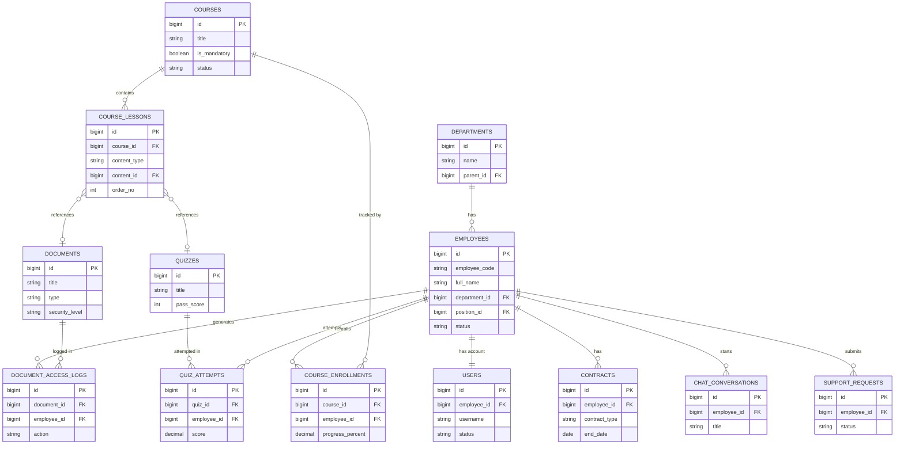

# TÀI LIỆU ĐẶC TẢ HỆ THỐNG ĐÀO TẠO NHÂN VIÊN (LMS)

| | |
|---|---|
| **Phiên bản** | v0.5 – Draft |
| **Ngày cập nhật** | 24/08/2026 |
| **Loại tài liệu** | Đặc tả chức năng (Functional Spec) – dạng Library |
| **Phạm vi** | Site Quản trị (Admin) + Site Người dùng (Employee) |
| **Công nghệ đề xuất** | Laravel + Tailwind CSS + Livewire |

> Tài liệu này tổng hợp và chuẩn hóa lại các yêu cầu đầu vào thành một đặc tả chức năng có cấu trúc, dùng làm tài liệu tham chiếu (library) cho đội thiết kế/phát triển. Các mục có đánh dấu **⚠️ Cần làm rõ** là những điểm còn mở, cần chốt thêm với stakeholder trước khi triển khai.

---

## 1. Tổng quan hệ thống

Hệ thống LMS nội bộ phục vụ hai nhóm người dùng chính, vận hành trên hai site tách biệt nhưng dùng chung một nền tảng dữ liệu:

| Site | Đối tượng sử dụng | Mục tiêu chính |
|---|---|---|
| **Site Quản trị (Admin)** | HR, Quản lý đào tạo, Người biên soạn nội dung, IT/Security | Quản lý nhân sự, biên soạn – xuất bản tài liệu đào tạo, cấu hình phân quyền, giám sát bảo mật |
| **Site Người dùng (User)** | Toàn bộ nhân viên (đặc biệt nhân viên mới/onboarding) | Học tập, làm bài kiểm tra, theo dõi tiến độ, tra cứu qua Chat AI, liên hệ hỗ trợ |

---

## 2. Kiến trúc phân hệ (Module Map)

```
LMS NỘI BỘ
├── SITE QUẢN TRỊ
│   ├── Quản lý nhân sự
│   │   ├── Quản lý tài khoản
│   │   ├── Thông tin nhân sự
│   │   ├── Hợp đồng
│   │   ├── Phân quyền
│   │   └── Cấu hình chung
│   ├── Tài liệu nội bộ
│   │   ├── Quản lý file (doc, excel, pdf...)
│   │   ├── Quản lý video
│   │   ├── Kiểm tra trắc nghiệm
│   │   ├── Cấu hình bộ tài liệu ban hành
│   │   └── Bài giảng
│   └── Bảo mật
│       ├── Phân quyền theo điều kiện
│       └── Chống thất thoát tài liệu (DRM/DLP)
└── SITE NGƯỜI DÙNG
    ├── Tài khoản & danh mục tài liệu được cấp quyền
    ├── Theo dõi thông tin & lịch sử học tập
    ├── Chat AI đào tạo (training data)
    ├── Onboarding nhân viên
    └── Liên hệ tư vấn / hỗ trợ
```

---

## 3. SITE QUẢN TRỊ

### 3.1. Quản lý nhân sự

#### 3.1.1. Quản lý tài khoản
- Tạo/sửa/khóa/xóa tài khoản nhân viên (thủ công hoặc import hàng loạt qua Excel).
- Cấu trúc tài khoản gắn với: mã nhân viên, phòng ban, chức danh, cấp bậc, trạng thái làm việc.
- Đồng bộ trạng thái tài khoản theo vòng đời nhân sự (thử việc → chính thức → nghỉ việc → khóa truy cập tự động).
- Lịch sử đăng nhập / thiết bị truy cập.

#### 3.1.2. Thông tin nhân sự
- Hồ sơ nhân viên: thông tin cá nhân, phòng ban, vị trí, quản lý trực tiếp, ngày vào làm.
- Liên kết với lộ trình đào tạo tương ứng theo vị trí/cấp bậc.
- Lịch sử thay đổi vị trí/phòng ban (audit trail).

#### 3.1.3. Hợp đồng
- Quản lý loại hợp đồng, thời hạn, ngày hiệu lực/hết hạn.
- Cảnh báo hợp đồng sắp hết hạn.
- Lưu trữ file hợp đồng scan/điện tử, gắn quyền xem theo vai trò (HR/quản lý trực tiếp).

#### 3.1.4. Phân quyền
- Phân quyền theo **vai trò** (Role-based) và **điều kiện cấu hình** (phòng ban, cấp bậc, vị trí, dự án…).
- Ma trận quyền: Xem / Tải xuống / Chỉnh sửa / Xuất bản / Xóa cho từng loại tài nguyên (tài liệu, video, bài kiểm tra, hồ sơ nhân sự).
- Hỗ trợ nhóm quyền (Role Group) để gán nhanh cho nhiều tài khoản.

#### 3.1.5. Cấu hình chung
- Cấu hình danh mục dùng chung: phòng ban, chức danh, cấp bậc, loại tài liệu, loại hợp đồng.
- Cấu hình thông báo (email/notification khi có tài liệu mới, bài kiểm tra mới, hợp đồng sắp hết hạn…).
- Cấu hình ngôn ngữ, giao diện, logo/thương hiệu hiển thị trên hai site.

---

### 3.2. Tài liệu nội bộ

#### 3.2.1. Quản lý file tài liệu
- Hỗ trợ định dạng: Word, Excel, PDF, PowerPoint…
- Gắn metadata: tiêu đề, mô tả, phòng ban áp dụng, cấp độ bảo mật, phiên bản.
- Quản lý versioning (lịch sử phiên bản tài liệu, rollback).

#### 3.2.2. Quản lý video
- Upload/stream video bài giảng.
- Cấu hình phụ đề, thời lượng, chương/mốc thời gian (chapter).
- Theo dõi % xem hết video theo từng nhân viên.

#### 3.2.3. Kiểm tra trắc nghiệm
- Cấu hình bộ câu hỏi + đáp án theo 2 cách: **nhập trực tiếp trên giao diện** hoặc **import từ Excel** (theo template chuẩn).
- Hỗ trợ nhiều loại câu hỏi: chọn 1 đáp án, chọn nhiều đáp án, đúng/sai.
- Cấu hình: số câu hỏi/lượt thi, thời gian làm bài, điểm đạt (pass score), số lần thi lại, trộn câu hỏi/đáp án.
- Lưu lịch sử kết quả từng lần thi của nhân viên.

#### 3.2.4. Cấu hình bộ tài liệu nội bộ ban hành
- Một **bộ tài liệu** (khóa học/lộ trình) gồm nhiều bài tài liệu con (file, video, bài giảng, bài kiểm tra) sắp xếp theo trình tự.
- Theo dõi **% tiến độ hoàn thành** của từng nhân viên trên từng bộ tài liệu.
- **Ghi lịch sử** truy cập/hoàn thành: ai đã học, học đến đâu, hoàn thành lúc nào, kết quả kiểm tra.
- Gắn điều kiện bắt buộc (bắt buộc/tự chọn) theo vị trí, phòng ban.

#### 3.2.5. Bài giảng
- Cấu hình số lượng bài học trong một bài giảng/khóa học.
- Mỗi bài học chọn **dạng nội dung** (văn bản, video, file đính kèm, trắc nghiệm) và **import nội dung tương ứng**.
- Sắp xếp thứ tự bài học, đặt điều kiện mở khóa bài học tiếp theo (học tuần tự hoặc tự do).

---

### 3.3. Bảo mật

#### 3.3.1. Phân quyền nhân viên theo điều kiện cấu hình
- Quyền truy cập tài liệu được tính toán động dựa trên điều kiện: phòng ban, vị trí, cấp bậc, dự án, trạng thái hợp đồng.
- Khi thông tin nhân sự thay đổi (chuyển phòng ban, thăng chức, nghỉ việc), quyền truy cập được cập nhật tự động theo điều kiện đã cấu hình.

#### 3.3.2. Chống thất thoát/trộm tài liệu
- Xem tài liệu ở chế độ trực tuyến (không cho tải xuống bản gốc) đối với tài liệu nhạy cảm.
- Watermark động (tên/email/thời gian truy cập) hiển thị trên tài liệu/video khi xem.
- Giới hạn số thiết bị đăng nhập đồng thời, cảnh báo truy cập bất thường.
- Ghi log chi tiết: ai xem, xem lúc nào, từ thiết bị/IP nào.
- **⚠️ Cần làm rõ**: "chuẩn ser" trong yêu cầu gốc — cần xác nhận đây là chuẩn bảo mật cụ thể nào (ví dụ ISO 27001, chuẩn nội bộ Techcombank, hay một chuẩn DRM/SSO cụ thể) để thiết kế đúng yêu cầu compliance.

---

## 4. SITE NGƯỜI DÙNG (Nhân viên training)

### 4.1. Tài khoản & danh mục tài liệu được cấp quyền
- Đăng nhập bằng tài khoản được Admin cấp (khuyến nghị tích hợp SSO nội bộ).
- Giao diện danh mục tài liệu **chỉ hiển thị nội dung nhân viên có quyền xem**, tương ứng với phòng ban/vị trí/cấp bậc.

### 4.2. Quản lý thông tin & lịch sử theo dõi quá trình
- Trang cá nhân: thông tin cơ bản, phòng ban, vị trí, quản lý trực tiếp.
- Lịch sử học tập: bộ tài liệu đã học, % tiến độ, kết quả kiểm tra, chứng nhận hoàn thành (nếu có).
- Nhắc việc: bài học/bộ tài liệu bắt buộc chưa hoàn thành, hạn chót (nếu có).

### 4.3. Chat AI hỗ trợ đào tạo
- Trợ lý AI trả lời câu hỏi dựa trên **nguồn dữ liệu là tài liệu đào tạo nội bộ đã được cấp quyền** cho nhân viên đó (tránh AI trả lời vượt phạm vi quyền truy cập).
- Gợi ý bài học/tài liệu liên quan đến câu hỏi.
- **⚠️ Cần làm rõ**: phạm vi dữ liệu huấn luyện AI (theo từng phòng ban riêng biệt hay dùng chung một kho tri thức có kiểm soát quyền truy vấn), và có lưu lịch sử hội thoại để cải thiện chất lượng trả lời hay không.

### 4.4. Onboarding nhân viên mới
- Lộ trình onboarding riêng, tự động gán khi tài khoản mới được tạo với trạng thái "nhân viên mới".
- Hiển thị thông tin công ty, quy trình, liên hệ đầu mối theo từng phòng ban.

### 4.5. Liên hệ tư vấn / hỗ trợ
- Danh sách đầu mối hỗ trợ theo từng vị trí/phòng ban (ví dụ: hỏi về hợp đồng → liên hệ HR; hỏi về nội dung bài giảng → liên hệ phòng đào tạo).
- Form gửi yêu cầu hỗ trợ, có theo dõi trạng thái xử lý.

---

## 5. Ma trận vai trò – chức năng (Role Matrix, tham khảo)

| Chức năng | Super Admin | Quản lý đào tạo | HR | Nhân viên |
|---|:---:|:---:|:---:|:---:|
| Quản lý tài khoản | ✅ | ⛔ | ✅ | ⛔ |
| Thông tin nhân sự / Hợp đồng | ✅ | ⛔ | ✅ | Xem của bản thân |
| Phân quyền hệ thống | ✅ | ⛔ | ⛔ | ⛔ |
| Cấu hình bộ tài liệu / bài giảng | ✅ | ✅ | ⛔ | ⛔ |
| Cấu hình bài kiểm tra | ✅ | ✅ | ⛔ | ⛔ |
| Xem báo cáo tiến độ toàn công ty | ✅ | ✅ | ✅ | ⛔ |
| Học tập / làm bài kiểm tra | ⛔ | ⛔ | ⛔ | ✅ |
| Chat AI đào tạo | ⛔ | ⛔ | ⛔ | ✅ |

> Bảng trên mang tính tham khảo ban đầu, cần đối chiếu với sơ đồ tổ chức thực tế để bổ sung thêm vai trò (ví dụ: Trưởng phòng ban xem báo cáo của phòng mình).

---

## 6. Định hướng thiết kế giao diện (UI/UX)

Cả hai site (Admin + User) dùng chung **tone màu Đỏ – Đen – Trắng**, phù hợp bộ nhận diện thương hiệu Techcombank. Theo các tài liệu nhận diện thương hiệu công khai, logo Techcombank sử dụng kết hợp ba tông màu này: <cite index="6-1">màu đỏ thể hiện sự nhiệt huyết, tận tâm; màu trắng thể hiện sự minh bạch, trong sáng; và tên thương hiệu kết hợp tông đỏ – đen tạo cảm giác mạnh mẽ, vững vàng</cite>.

### 6.1. Bảng màu đề xuất (tham khảo – cần đối chiếu Brand Guideline/CIP chính thức)

| Vai trò màu | Mã màu gợi ý | Ứng dụng |
|---|---|---|
| Đỏ chủ đạo (Primary) | `#C8102E` *(tham khảo)* | Nút CTA chính, thanh điều hướng, trạng thái nhấn mạnh/cảnh báo tiến độ |
| Đen (Ink) | `#1A1A1A` | Tiêu đề, văn bản chính, sidebar admin |
| Trắng (Base) | `#FFFFFF` | Nền chính, vùng nội dung, card |
| Xám trung tính bổ trợ | `#F5F5F5` / `#4D4D4D` | Nền phụ, đường viền, văn bản phụ (giúp giảm chói khi dùng nhiều nội dung dạng bảng, danh sách) |
| Đỏ nhạt (Tint) | `#FCE8E8` | Nền cảnh báo nhẹ, badge trạng thái |

> ⚠️ **Lưu ý quan trọng**: mã màu trên chỉ là tham khảo để dựng wireframe/prototype. Trước khi lên thiết kế chính thức, cần đối chiếu với **bộ Brand Guideline (CIP) nội bộ của Techcombank** để lấy đúng mã Pantone/CMYK/Hex chuẩn, tránh lệch tông khi triển khai thật.

### 6.2. Nguyên tắc áp dụng

**Site Quản trị (Admin)**
- Ưu tiên nền trắng/xám nhạt cho vùng làm việc (bảng dữ liệu, form) để đảm bảo dễ đọc khi thao tác nhiều.
- Đỏ dùng có kiểm soát: nút hành động chính, trạng thái cảnh báo (hợp đồng sắp hết hạn, tài liệu chưa xuất bản), biểu đồ tiến độ.
- Đen dùng cho typography chính, sidebar điều hướng — tạo cảm giác chuyên nghiệp, chắc chắn.
- Tránh dùng đỏ tràn lan trên diện rộng (nền lớn) vì môi trường admin cần sự "yên tĩnh thị giác" khi làm việc lâu.

**Site Người dùng (User)**
- Có thể dùng đỏ mạnh mẽ hơn ở phần hero/banner khóa học, tiến độ học tập (progress bar), badge hoàn thành — tạo cảm hứng học tập.
- Đen – trắng làm nền chủ đạo cho nội dung bài học, video, để không gây mỏi mắt khi học lâu.
- Các thành phần tương tác (nút "Bắt đầu học", "Làm bài kiểm tra", Chat AI) dùng đỏ làm điểm nhấn CTA.

### 6.3. Typography & thành phần UI
- Font chữ: chọn font sans-serif hiện đại, đậm ở tiêu đề (đồng điệu với phong cách chữ in hoa, khối chắc của logo Techcombank), regular ở nội dung để đảm bảo khả năng đọc.
- Card/Table: bo góc nhẹ, dùng viền xám nhạt thay vì viền đen để tránh cảm giác nặng nề.
- Icon trạng thái tiến độ (chưa học/đang học/hoàn thành) nên dùng biến thể đỏ – xám – đen thay vì thêm màu xanh/lục để giữ tính nhất quán tone thương hiệu.
- Đảm bảo độ tương phản (contrast) đạt chuẩn accessibility (WCAG AA) giữa chữ đen/trắng trên nền đỏ.

### 6.4. Kiến trúc thiết kế Site Quản trị — đơn giản, hiệu quả, tránh "AI hóa"

Admin là công cụ vận hành hàng ngày (nhập liệu, duyệt tài liệu, tra soát), không phải trang giới thiệu — mục tiêu thiết kế là **tốc độ thao tác và độ chính xác thông tin**, không phải sự ấn tượng thị giác. "Không AI hóa" ở đây hiểu là: tránh những mô-típ thị giác chung chung, na ná mọi công cụ khác, thiếu chủ đích — thay vào đó mọi lựa chọn (bố cục, khoảng trắng, màu) phải phục vụ đúng một tác vụ cụ thể của người quản trị.

**Nguyên tắc bố cục**
- Layout cố định, quen thuộc: sidebar trái cố định theo đúng cây module ở mục 2 (Nhân sự / Tài liệu nội bộ / Bảo mật), top bar chỉ chứa tìm kiếm – thông báo – tài khoản. Không dùng landing-page pattern (hero lớn, banner minh họa, section giới thiệu) cho các màn hình vận hành.
- Vùng nội dung chính luôn là **bảng dữ liệu hoặc form**, có filter/search/sort/bulk-action đi kèm — ưu tiên hiển thị được nhiều dữ liệu trong một màn hình (density) hơn là dàn trải nhiều khoảng trắng trang trí.
- Wizard nhiều bước chỉ dùng khi nghiệp vụ **thực sự tuần tự** (ví dụ: cấu hình một bộ tài liệu ban hành gồm nhiều bài học theo thứ tự) — không biến các form đơn giản (sửa hồ sơ nhân viên) thành wizard cho "có vẻ chuyên nghiệp".

**Nguyên tắc thị giác — những mô-típ nên tránh**
- Tránh 3 kiểu phối màu/bố cục thường thấy ở giao diện do AI generate hàng loạt: (1) nền be/kem + chữ serif tương phản cao + màu cam đất; (2) nền đen tuyền + một màu neon nổi bật; (3) bố cục kiểu báo in với đường kẻ mảnh, bo góc bằng 0, cột dày đặc. Cả ba đều không liên quan đến bộ nhận diện Techcombank, dùng sẽ khiến hệ thống trông rời rạc với thương hiệu.
- Không dùng hiệu ứng trang trí không phục vụ tác vụ: gradient nền, glassmorphism (kính mờ), shadow nổi khối cho mọi card, icon minh họa 3D. Bo góc, độ đậm viền, khoảng cách phải **nhất quán tuyệt đối** theo một bộ token duy nhất (khai báo 1 lần trong `tailwind.config.js`), không chỉnh tay riêng lẻ từng màn hình — sự thiếu nhất quán giữa các màn hình là nguyên nhân chính khiến một admin panel trông như ghép từ nhiều mẫu có sẵn.
- Chuyển động (motion) chỉ dùng cho phản hồi trạng thái: loading skeleton khi tải bảng, toast xác nhận khi lưu, hover nhẹ trên dòng bảng. Không dùng animation trang trí (parallax, fade-in theo scroll…) — môi trường làm việc cả ngày cần "yên tĩnh thị giác".
- Điểm nhấn thương hiệu (đỏ) nên xuất hiện có chủ đích, lặp lại nhất quán — ví dụ: một **viền đỏ mỏng bên trái** cho mục điều hướng đang chọn, chấm đỏ nhỏ cho số lượng việc cần xử lý (badge). Đây là "chữ ký" tối giản, không cần thêm chi tiết trang trí nào khác.

**Hình khối & bo góc — hướng tới cảm giác "chắc, có lực"**

Vì là hệ thống ngân hàng, hình khối bên Admin nên nghiêng về **sắc nét, hạn chế bo tròn**, tránh phong cách "mềm" thường thấy ở app tiêu dùng:
- Bo góc nhỏ và nhất quán cho toàn bộ card/bảng/input (khoảng **2–4px**, không dùng bo tròn lớn kiểu "bo mềm" hay pill-shape) — góc gần vuông tạo cảm giác chuẩn mực, nghiêm túc, đúng tinh thần chứng từ/báo cáo ngân hàng hơn là một ứng dụng giải trí.
- Viền (border) dùng độ đậm rõ ràng (1–1.5px, đen/xám đậm) để phân định vùng dữ liệu dứt khoát, thay vì chỉ dựa vào shadow mờ hoặc khoảng trắng.
- Nút hành động chính (Lưu, Duyệt, Xuất bản, Xóa) dùng khối chữ nhật, bo rất nhẹ, nền đặc (đỏ cho hành động chính, đen/xám cho hành động phụ) — **không dùng nút bo tròn hoàn toàn (pill)**, vì dạng này tạo cảm giác thân thiện/tiêu dùng, không phù hợp bối cảnh nghiệp vụ.
- Tiêu đề bảng, nhãn cột, số liệu quan trọng dùng độ đậm chữ cao hơn (600–700) để tạo trọng lượng thị giác — giúp giao diện "có lực" mà vẫn giữ tối giản, không cần thêm màu hay hoạ tiết.

**Kết quả mong muốn**: một quản trị viên mới có thể đoán được vị trí chức năng chỉ dựa vào cấu trúc quen thuộc (sidebar → bảng → form), không cần học lại cách dùng giao diện ở từng màn hình; tổng thể toát lên sự chuẩn mực, đáng tin cậy đúng chất một hệ thống ngân hàng, không lòe loẹt, không mềm mại thái quá.

### 6.5. Kiến trúc thiết kế Site Người dùng — responsive PC & Mobile, mobile trải nghiệm như app

Khác với Admin, site người dùng phục vụ việc học — trải nghiệm cần **thoải mái, liền mạch**, và trên mobile phải cảm giác như một ứng dụng thật (native app) chứ không phải bản desktop thu nhỏ.

**Chiến lược breakpoint (dùng breakpoint mặc định của Tailwind)**

| Thiết bị | Breakpoint | Bố cục chính |
|---|---|---|
| Mobile | `< 640px` (mặc định, không prefix) | 1 cột, **bottom tab bar** thay cho menu trên, header tối giản (nút back + tiêu đề) |
| Tablet | `sm` / `md` (640–1024px) | 1–2 cột, sidebar có thể thu gọn thành drawer trượt |
| Desktop (PC) | `lg` trở lên (≥ 1024px) | 2–3 cột: sidebar điều hướng + nội dung bài học + panel tiến độ/ghi chú bên phải |

**Mobile — thiết kế "giống app"**
- **Bottom navigation bar** cố định 4–5 mục chính (VD: Khóa học – Tiến độ của tôi – Chat AI – Hỗ trợ – Cá nhân), icon + nhãn ngắn, mục đang chọn nhấn màu đỏ thương hiệu — đây là điểm khác biệt lớn nhất so với web thường (web thường dồn hết vào menu hamburger).
- Touch target tối thiểu 44×44px, thao tác vuốt (swipe) cho các luồng tự nhiên: lướt qua danh sách khóa học, chuyển giữa các câu hỏi trắc nghiệm.
- Header dạng sticky tối giản khi vào chi tiết bài học (nút back – tiêu đề – tiến độ %), không lặp lại toàn bộ menu như desktop.
- Chuyển màn hình dùng hiệu ứng trượt (push/pop) giống app gốc thay vì tải lại trắng trang — về mặt kỹ thuật tận dụng `wire:navigate` của Livewire 3 (kết hợp Alpine.js đi kèm) để chuyển trang không reload toàn bộ, tạo cảm giác mượt như SPA/app thật.
- Cân nhắc khai báo **Web App Manifest** (icon, tên hiển thị, theme-color đỏ thương hiệu) để nhân viên có thể "Thêm vào Màn hình chính" trên điện thoại — khi đó app chạy full-screen, không thanh địa chỉ trình duyệt, gần như một app cài đặt thật.
- Trạng thái tải dùng skeleton loading (khung xám nhấp nháy đúng hình dạng nội dung sắp hiện) thay vì spinner đơn thuần — cảm giác quen thuộc với người dùng app di động.

**PC/Desktop**
- Tận dụng chiều ngang: nội dung bài học ở giữa với độ rộng dòng đọc thoải mái (không kéo full màn hình gây khó đọc), panel bên phải hiển thị tiến độ khóa học/ghi chú/mục lục bài học.
- Giữ điều hướng dạng sidebar cố định (không cần bottom bar) vì thao tác chính trên PC là click + đọc dài, không phải cầm ngón tay lướt.
- Video học có thể mở chế độ theatre/full-width riêng cho desktop.

**Hình khối & bo góc — hướng tới cảm giác "mềm mại, dễ tiếp cận"**

Ngược lại với Admin, site người dùng phục vụ trải nghiệm học tập nên chủ động **mềm mại hơn** để giảm áp lực, tạo cảm giác thân thiện:
- Bo góc lớn hơn rõ rệt cho card khóa học, khung bài học, ô nhập, modal (khoảng **12–20px**), thay vì góc vuông sắc như Admin.
- Nút CTA học tập ("Bắt đầu học", "Làm bài kiểm tra", "Tiếp tục") có thể dùng bo tròn nhiều hơn, kể cả dạng pill cho nút phụ (tag, filter môn học) — tạo cảm giác mời gọi thay vì mệnh lệnh.
- Shadow đổ nhẹ, lan tỏa mềm (soft blur) cho card nổi bật, hạn chế viền cứng — khác hẳn border đậm bên Admin.
- Khoảng cách (spacing) giữa các khối rộng rãi, "thở" hơn so với mật độ dày của Admin, phù hợp nhịp đọc/học thong thả thay vì tra soát dữ liệu nhanh.

**Nguyên tắc chung cho cả hai**: cùng một bộ token màu từ `tailwind.config.js` (mục 7.2) nhưng **tách riêng thang bo góc** cho Admin (sắc, có lực) và User (mềm, thân thiện) — chỉ khác cách sắp xếp bố cục theo breakpoint và độ mềm/cứng của hình khối, còn bộ nhận diện thương hiệu (đỏ – đen – trắng) vẫn nhất quán dù học trên thiết bị nào.

---

## 7. Công nghệ & kiến trúc kỹ thuật

Stack đề xuất: **Laravel (Backend + rendering) + Tailwind CSS (UI) + Livewire (tương tác reactive)**. Đây là bộ full-stack PHP phù hợp với quy mô một hệ thống nội bộ (không cần tách riêng SPA + API), giúp rút ngắn thời gian phát triển và dễ bảo trì cho cả hai site Admin/User trên cùng một codebase.

### 7.1. Vai trò từng thành phần

| Thành phần | Vai trò trong hệ thống |
|---|---|
| **Laravel** | Xử lý nghiệp vụ, auth/phân quyền, quản lý dữ liệu (nhân sự, tài liệu, kết quả kiểm tra), hàng đợi (queue) cho các tác vụ nặng như import Excel, convert video |
| **Livewire** | Toàn bộ tương tác động: form CRUD tài khoản/hợp đồng, upload tài liệu, làm bài trắc nghiệm, thanh tiến độ % theo thời gian thực, Chat AI widget — không cần dựng API riêng cho SPA |
| **Tailwind CSS** | Dựng UI theo đúng tone Đỏ – Đen – Trắng đã định hướng ở mục 6, dùng chung 1 bộ token màu cho cả Admin & User site |

### 7.2. Cấu hình Tailwind theo bảng màu thương hiệu

Khai báo màu thương hiệu trong `tailwind.config.js` để toàn bộ component (Blade + Livewire) dùng chung một nguồn màu, tránh hard-code hex rải rác:

```js
// tailwind.config.js
module.exports = {
  content: [
    "./resources/**/*.blade.php",
    "./app/Livewire/**/*.php",
  ],
  theme: {
    extend: {
      colors: {
        brand: {
          red: {
            DEFAULT: "#C8102E", // tham khảo — đối chiếu CIP chính thức trước khi lên production
            tint: "#FCE8E8",
            dark: "#A00E24",
          },
          ink: "#1A1A1A",
          white: "#FFFFFF",
          gray: {
            light: "#F5F5F5",
            DEFAULT: "#4D4D4D",
          },
        },
      },
      borderRadius: {
        // Site Quản trị: bo góc nhỏ, giữ cảm giác chắc chắn, "có lực"
        "admin-sm": "2px",
        admin: "4px",
        // Site Người dùng: bo góc lớn, tạo cảm giác mềm mại, dễ tiếp cận
        "user-md": "12px",
        "user-lg": "20px",
        "user-pill": "999px",
      },
    },
  },
};
```

Nhờ đó, component Livewire chỉ cần dùng class như `bg-brand-red`, `text-brand-ink`, `bg-brand-gray-light` — nếu sau này có mã màu chính thức từ Brand Guideline, chỉ cần sửa 1 chỗ trong config. Riêng `borderRadius` tách hẳn hai thang giá trị: layout Admin dùng `rounded-admin`/`rounded-admin-sm`, layout User dùng `rounded-user-md`/`rounded-user-lg`/`rounded-user-pill` — đảm bảo hai site có "chất" hình khối khác nhau (sắc/có lực vs. mềm mại) dù dùng chung một hệ token màu.

### 7.3. Đề xuất module Livewire theo chức năng

| Nhóm chức năng (mục 3, 4) | Gợi ý Livewire Component |
|---|---|
| Quản lý tài khoản / nhân sự / hợp đồng | `Admin\AccountManager`, `Admin\EmployeeProfile`, `Admin\ContractManager` |
| Phân quyền | `Admin\PermissionMatrix` (kết hợp package `spatie/laravel-permission`) |
| Quản lý file/video/bài giảng | `Admin\DocumentLibrary`, `Admin\VideoUploader`, `Admin\LessonBuilder` |
| Cấu hình bộ tài liệu + % tiến độ | `Admin\CourseBuilder`, `User\CourseProgressTracker` |
| Kiểm tra trắc nghiệm (nhập tay / import Excel) | `Admin\QuizBuilder` (kết hợp `maatwebsite/excel` cho import), `User\QuizPlayer` |
| Lịch sử học tập / audit log | `User\LearningHistory` (kết hợp `spatie/laravel-activitylog`) |
| Chat AI đào tạo | `User\TrainingChatWidget` (gọi API LLM qua Laravel HTTP Client, giới hạn nguồn dữ liệu theo quyền của nhân viên) |
| Onboarding | `User\OnboardingWizard` |
| Liên hệ hỗ trợ | `User\SupportRequestForm` |

### 7.4. Package Laravel gợi ý (tham khảo, cần đánh giá kỹ trước khi chọn)

- **`spatie/laravel-permission`** — quản lý role & permission theo điều kiện (mục 3.1.4, 3.3.1).
- **`maatwebsite/excel`** — import/export Excel cho bộ câu hỏi trắc nghiệm và danh sách nhân sự.
- **`spatie/laravel-medialibrary`** — quản lý file/video tập trung, sinh nhiều phiên bản (thumbnail, chuyển mã).
- **`spatie/laravel-activitylog`** — ghi lịch sử thao tác/tiến độ học tập phục vụ mục 3.2.4 và 3.3.2.
- **Laravel Queue + Horizon** — xử lý nền cho import Excel số lượng lớn, convert video.
- **Laravel Reverb / Pusher** *(tùy chọn)* — nếu cần cập nhật % tiến độ hoặc thông báo theo thời gian thực giữa các phiên Livewire.

> ⚠️ Về watermark/chống chụp màn hình ở mục 3.3.2: Livewire/Laravel có thể hỗ trợ watermark động (chèn tên/email/thời gian qua overlay khi render) và giới hạn tải xuống bản gốc, nhưng đây là biện pháp **ngăn chặn/truy vết**, không thể chặn tuyệt đối việc quay/chụp màn hình từ phía client — cần nêu rõ giới hạn này với đội bảo mật khi chốt yêu cầu compliance.

### 7.5. Câu hỏi mở về công nghệ

- Xác thực có cần tích hợp SSO (SAML/OAuth) với hệ thống nội bộ Techcombank, hay dùng auth nội bộ của Laravel (Breeze/Jetstream + Livewire)?
- Video bài giảng lưu trữ và stream qua đâu (self-host + Laravel + FFmpeg, hay dịch vụ ngoài như Mux/Cloudflare Stream) — ảnh hưởng trực tiếp đến khả năng chống tải xuống ở mục 3.3.2?
- Chat AI dùng LLM nào (nội bộ/on-prem hay gọi API ngoài) — liên quan đến yêu cầu bảo mật dữ liệu nội bộ ngân hàng?

---

## 9. Thiết kế cơ sở dữ liệu (Database Design)

Thiết kế dưới đây theo quy ước Laravel/Eloquent: tên bảng số nhiều, snake_case, khóa chính `id` (bigIncrements), có `created_at`/`updated_at` (và khuyến nghị `deleted_at` — soft delete — cho các bảng cần giữ lịch sử dù bị "xóa"). Phần này là **đặc tả logic**, khi lên migration thật cần bổ sung index/ràng buộc chi tiết theo mục 9.9.

### 9.1. Nguyên tắc thiết kế
- Tách bạch **tài khoản đăng nhập** (`users`) khỏi **hồ sơ nhân sự** (`employees`) — đúng với việc "Quản lý tài khoản" và "Thông tin nhân sự" là hai chức năng riêng ở mục 3.1.
- Một bảng `documents` dùng chung cho cả file và video (phân biệt bằng `type`), tránh trùng lặp logic quyền/versioning; metadata riêng của video tách sang `video_meta` (1-1).
- `course_lessons` tham chiếu nội dung theo kiểu đa hình (`content_type` + `content_id`) để một bài học có thể trỏ tới `documents` hoặc `quizzes` mà không cần nhiều cột FK rời rạc.
- Toàn bộ hành vi cần "ghi lịch sử" (mục 3.2.4, 3.3.2) đều có bảng log riêng, tách khỏi bảng nghiệp vụ chính để không làm phình bảng giao dịch và dễ archive/xóa theo chính sách lưu trữ riêng.

### 9.2. Nhóm bảng: Nhân sự & tài khoản

**`departments`**
| Cột | Kiểu | Ghi chú |
|---|---|---|
| id | bigint PK | |
| name | string | Tên phòng ban |
| code | string | Mã phòng ban, unique |
| parent_id | bigint FK → departments.id | Tự tham chiếu, cho phép phòng ban con |

**`positions`**
| Cột | Kiểu | Ghi chú |
|---|---|---|
| id | bigint PK | |
| name | string | Tên vị trí |
| level | int | Cấp bậc, dùng cho điều kiện phân quyền |
| department_id | bigint FK → departments.id, nullable | |

**`employees`**
| Cột | Kiểu | Ghi chú |
|---|---|---|
| id | bigint PK | |
| employee_code | string, unique | Mã nhân viên |
| full_name | string | |
| email | string, unique | |
| phone | string, nullable | |
| department_id | bigint FK → departments.id | |
| position_id | bigint FK → positions.id | |
| manager_id | bigint FK → employees.id, nullable | Quản lý trực tiếp (tự tham chiếu) |
| hire_date | date | |
| status | enum(`probation`,`active`,`resigned`) | Vòng đời nhân sự |
| avatar_path | string, nullable | |

**`users`** (tài khoản đăng nhập)
| Cột | Kiểu | Ghi chú |
|---|---|---|
| id | bigint PK | |
| employee_id | bigint FK → employees.id, unique | Quan hệ 1–1 |
| username | string, unique | |
| email | string, unique | |
| password | string | Hashed |
| status | enum(`active`,`locked`,`disabled`) | Đồng bộ theo trạng thái `employees.status` |
| last_login_at | timestamp, nullable | |
| last_login_ip | string, nullable | |

**`contracts`**
| Cột | Kiểu | Ghi chú |
|---|---|---|
| id | bigint PK | |
| employee_id | bigint FK → employees.id | |
| contract_type | enum(`thu_viec`,`xac_dinh_thoi_han`,`khong_xac_dinh_thoi_han`) | |
| start_date / end_date | date / date nullable | |
| file_path | string | File hợp đồng scan/điện tử |
| status | enum(`active`,`expiring_soon`,`expired`,`terminated`) | `expiring_soon` tính bằng job định kỳ để cảnh báo |
| created_by | bigint FK → users.id | |

### 9.3. Nhóm bảng: Phân quyền & bảo mật

**`roles`** / **`permissions`** / **`model_has_roles`** / **`role_has_permissions`**
> Theo đúng cấu trúc chuẩn của package `spatie/laravel-permission` (mục 7.4) — không thiết kế lại từ đầu để tận dụng tooling có sẵn.

**`permission_conditions`** (điều kiện phân quyền động — mục 3.1.4 & 3.3.1)
| Cột | Kiểu | Ghi chú |
|---|---|---|
| id | bigint PK | |
| role_id | bigint FK → roles.id, nullable | Áp cho cả nhóm role... |
| user_id | bigint FK → users.id, nullable | ...hoặc gán riêng lẻ |
| condition_type | enum(`department`,`position`,`level`,`project`) | |
| condition_value | string/json | VD: id phòng ban hoặc danh sách id |
| resource_type | enum(`document`,`course`,`video`,`quiz`) | Điều kiện áp dụng cho loại tài nguyên nào |

**`device_sessions`** (giới hạn thiết bị đăng nhập đồng thời)
| Cột | Kiểu | Ghi chú |
|---|---|---|
| id | bigint PK | |
| user_id | bigint FK → users.id | |
| device_id | string | |
| ip_address | string | |
| user_agent | string | |
| last_active_at | timestamp | |
| is_revoked | boolean, default false | |

**`document_access_logs`** (log truy cập/watermark — mục 3.3.2)
| Cột | Kiểu | Ghi chú |
|---|---|---|
| id | bigint PK | |
| document_id | bigint FK → documents.id | |
| employee_id | bigint FK → employees.id | |
| action | enum(`view`,`download_attempt`,`print_attempt`) | |
| watermark_text | string, nullable | Nội dung watermark đã chèn khi xem |
| ip_address | string | |
| device_id | string, nullable | |

### 9.4. Nhóm bảng: Tài liệu & bài giảng

**`documents`** (dùng chung cho file và video)
| Cột | Kiểu | Ghi chú |
|---|---|---|
| id | bigint PK | |
| title | string | |
| description | text, nullable | |
| type | enum(`file`,`video`) | |
| file_path | string | |
| file_type | string | pdf / xlsx / docx / mp4... |
| version_no | int, default 1 | |
| security_level | enum(`normal`,`restricted`) | `restricted` → bật watermark + chặn tải xuống |
| allow_download | boolean, default true | |
| department_scope | json, nullable | Danh sách phòng ban áp dụng |
| uploaded_by | bigint FK → users.id | |
| status | enum(`draft`,`published`,`archived`) | |

**`document_versions`** (lịch sử phiên bản — mục 3.2.1)
| Cột | Kiểu | Ghi chú |
|---|---|---|
| id | bigint PK | |
| document_id | bigint FK → documents.id | |
| version_no | int | |
| file_path | string | |
| uploaded_by | bigint FK → users.id | |
| note | string, nullable | Ghi chú thay đổi |

**`video_meta`** (metadata riêng cho video — mục 3.2.2, quan hệ 1–1 với `documents` khi `type = video`)
| Cột | Kiểu | Ghi chú |
|---|---|---|
| id | bigint PK | |
| document_id | bigint FK → documents.id, unique | |
| duration_seconds | int | |
| provider | enum(`local`,`s3`,`mux`,`cloudflare_stream`) | |
| thumbnail_path | string, nullable | |
| captions_path | string, nullable | |

**`courses`** (bộ tài liệu nội bộ ban hành — mục 3.2.4)
| Cột | Kiểu | Ghi chú |
|---|---|---|
| id | bigint PK | |
| title | string | |
| description | text, nullable | |
| is_mandatory | boolean, default false | |
| is_onboarding | boolean, default false | Tự động gán cho nhân viên mới (mục 4.4) |
| target_scope | json, nullable | Phòng ban/vị trí áp dụng |
| status | enum(`draft`,`published`,`archived`) | |
| created_by | bigint FK → users.id | |

**`course_lessons`** (bài giảng — mục 3.2.5)
| Cột | Kiểu | Ghi chú |
|---|---|---|
| id | bigint PK | |
| course_id | bigint FK → courses.id | |
| title | string | |
| content_type | enum(`document`,`video`,`quiz`,`text`) | |
| content_id | bigint, nullable | FK đa hình → `documents.id` hoặc `quizzes.id` tùy `content_type` |
| text_content | text, nullable | Dùng khi `content_type = text` |
| order_no | int | Thứ tự bài học |
| is_required | boolean, default true | |
| unlock_condition | enum(`sequential`,`free`) | Học tuần tự hay tự do |

### 9.5. Nhóm bảng: Kiểm tra trắc nghiệm

**`quizzes`**
| Cột | Kiểu | Ghi chú |
|---|---|---|
| id | bigint PK | |
| title | string | |
| pass_score | int | % điểm đạt |
| time_limit_minutes | int, nullable | |
| shuffle_questions | boolean, default true | |
| max_attempts | int, nullable | null = không giới hạn |
| created_by | bigint FK → users.id | |

**`quiz_questions`**
| Cột | Kiểu | Ghi chú |
|---|---|---|
| id | bigint PK | |
| quiz_id | bigint FK → quizzes.id | |
| question_text | text | |
| question_type | enum(`single_choice`,`multiple_choice`,`true_false`) | |
| order_no | int | |

**`quiz_options`**
| Cột | Kiểu | Ghi chú |
|---|---|---|
| id | bigint PK | |
| question_id | bigint FK → quiz_questions.id | |
| option_text | string | |
| is_correct | boolean | |
| order_no | int | |

**`quiz_attempts`**
| Cột | Kiểu | Ghi chú |
|---|---|---|
| id | bigint PK | |
| quiz_id | bigint FK → quizzes.id | |
| employee_id | bigint FK → employees.id | |
| attempt_no | int | |
| score | decimal | |
| passed | boolean | |
| started_at / finished_at | timestamp / timestamp nullable | |

**`quiz_attempt_answers`**
| Cột | Kiểu | Ghi chú |
|---|---|---|
| id | bigint PK | |
| attempt_id | bigint FK → quiz_attempts.id | |
| question_id | bigint FK → quiz_questions.id | |
| selected_option_ids | json | |
| is_correct | boolean | |

### 9.6. Nhóm bảng: Tiến độ học tập & lịch sử

**`course_enrollments`**
| Cột | Kiểu | Ghi chú |
|---|---|---|
| id | bigint PK | |
| course_id | bigint FK → courses.id | |
| employee_id | bigint FK → employees.id | |
| status | enum(`not_started`,`in_progress`,`completed`) | |
| progress_percent | decimal | |
| started_at / completed_at | timestamp nullable | |

**`lesson_progress`**
| Cột | Kiểu | Ghi chú |
|---|---|---|
| id | bigint PK | |
| enrollment_id | bigint FK → course_enrollments.id | |
| lesson_id | bigint FK → course_lessons.id | |
| status | enum(`not_started`,`in_progress`,`completed`) | |
| progress_percent | decimal | Dùng cho video/tài liệu dài |
| last_accessed_at / completed_at | timestamp nullable | |

**`activity_logs`** (audit trail chung — mục 3.1.2, 3.2.4)
| Cột | Kiểu | Ghi chú |
|---|---|---|
| id | bigint PK | |
| employee_id | bigint FK → employees.id, nullable | |
| user_id | bigint FK → users.id, nullable | Khi hành động do admin thực hiện |
| action | string | VD: `course.completed`, `profile.department_changed` |
| subject_type / subject_id | string / bigint | Đa hình, trỏ tới bản ghi liên quan |
| description | string, nullable | |
| ip_address | string, nullable | |

### 9.7. Nhóm bảng: Site người dùng

**`chat_conversations`**
| Cột | Kiểu | Ghi chú |
|---|---|---|
| id | bigint PK | |
| employee_id | bigint FK → employees.id | |
| title | string, nullable | |

**`chat_messages`**
| Cột | Kiểu | Ghi chú |
|---|---|---|
| id | bigint PK | |
| conversation_id | bigint FK → chat_conversations.id | |
| role | enum(`user`,`assistant`) | |
| content | text | |
| referenced_document_ids | json, nullable | Tài liệu AI đã dùng để trả lời, phục vụ truy vết |

**`support_contacts`** (đầu mối hỗ trợ theo vị trí — mục 4.5)
| Cột | Kiểu | Ghi chú |
|---|---|---|
| id | bigint PK | |
| department_id | bigint FK → departments.id, nullable | |
| position_id | bigint FK → positions.id, nullable | |
| contact_name | string | |
| contact_channel | string | Email/số điện thoại/kênh chat |
| description | string, nullable | |

**`support_requests`**
| Cột | Kiểu | Ghi chú |
|---|---|---|
| id | bigint PK | |
| employee_id | bigint FK → employees.id | |
| category | string | |
| message | text | |
| status | enum(`open`,`in_progress`,`resolved`) | |
| assigned_to | bigint FK → users.id, nullable | |
| resolved_at | timestamp, nullable | |

### 9.8. Sơ đồ ERD tổng quan



> Sơ đồ trên lược bớt các bảng phụ trợ (`positions`, `document_versions`, `video_meta`, `quiz_questions`, `quiz_options`, `quiz_attempt_answers`, `lesson_progress`, `permission_conditions`, `device_sessions`, `activity_logs`, `support_contacts`) để giữ tổng quan dễ đọc — chi tiết đầy đủ xem các bảng ở mục 9.2–9.7.

### 9.9. Ghi chú kỹ thuật khi lên migration thật
- **Index**: đánh composite index cho các cặp cột tra cứu thường xuyên — `(employee_id, course_id)` trên `course_enrollments`, `(document_id, employee_id)` trên `document_access_logs`, `(quiz_id, employee_id)` trên `quiz_attempts`.
- **Soft delete**: bật `deleted_at` cho `employees`, `documents`, `courses` — nhân viên nghỉ việc hay tài liệu ngừng dùng vẫn cần giữ để tra soát lịch sử, không xóa cứng.
- **Cột JSON** (`department_scope`, `target_scope`, `condition_value`, `referenced_document_ids`): MySQL 5.7+/MariaDB 10.2+ hỗ trợ kiểu `JSON` gốc; nếu cần lọc nhanh theo giá trị bên trong, cân nhắc thêm generated column + index.
- **Enum vs bảng danh mục**: các cột `enum` (status, type…) phù hợp cho giá trị cố định, ít đổi; nếu nghiệp vụ có thể phát sinh thêm trạng thái theo thời gian (ví dụ thêm loại hợp đồng mới), nên chuyển sang bảng danh mục riêng (`contract_types`) thay vì sửa enum ở migration.
- **Polymorphic FK** (`course_lessons.content_id`, `activity_logs.subject_id`): dùng đúng cơ chế `morphTo()` của Eloquent thay vì tự quản lý bằng tay, để tận dụng eager-loading và tránh lỗi tham chiếu sai bảng.

### 9.10. Câu hỏi mở về thiết kế DB
- Có cần bảng `certificates` (chứng chỉ hoàn thành) riêng, hay chỉ cần cờ `completed_at` trên `course_enrollments` là đủ?
- `permission_conditions` có cần hỗ trợ điều kiện kết hợp (VD: phòng ban A **và** cấp bậc ≥ 3) hay chỉ một điều kiện đơn mỗi dòng?
- Chat AI có cần lưu embedding/vector riêng để phục vụ tìm kiếm ngữ nghĩa (RAG), hay xử lý hoàn toàn qua dịch vụ AI ngoài và chỉ lưu lại nội dung hội thoại như thiết kế hiện tại?
- Hệ thống có cần thiết kế multi-tenant (nhiều công ty con/chi nhánh dùng chung nền tảng) ngay từ đầu, hay chỉ single-tenant cho Techcombank?

---

## 10. Các điểm cần làm rõ thêm (Open Questions)

1. Chuẩn bảo mật "chống trộm tài liệu" cụ thể cần áp dụng là gì (ISO 27001, chuẩn nội bộ, hay yêu cầu DRM cụ thể)?
2. Chat AI training data: nguồn dữ liệu huấn luyện lấy từ toàn bộ tài liệu hay giới hạn theo quyền truy cập từng nhân viên?
3. Có cần cấp **chứng chỉ hoàn thành** (certificate) sau khi hoàn tất bộ tài liệu/khóa học không?
4. Hệ thống có cần tích hợp SSO với hệ thống nhân sự (HRM) hiện có của Techcombank không, hay xây dựng độc lập?
5. Bộ mã màu chính thức (Pantone/CMYK/Hex) theo Brand Guideline nội bộ — cần xin bản CIP chính thức để đội thiết kế bám sát.

---

*Tài liệu này là bản nháp (v0.5 — đã bổ sung công nghệ Laravel + Tailwind CSS + Livewire, kiến trúc thiết kế Admin/User, định hướng hình khối "sắc – có lực" cho Admin vs "mềm mại" cho User, và thiết kế cơ sở dữ liệu chi tiết kèm ERD), dùng để thống nhất phạm vi chức năng trước khi chuyển sang giai đoạn wireframe/UI design.*